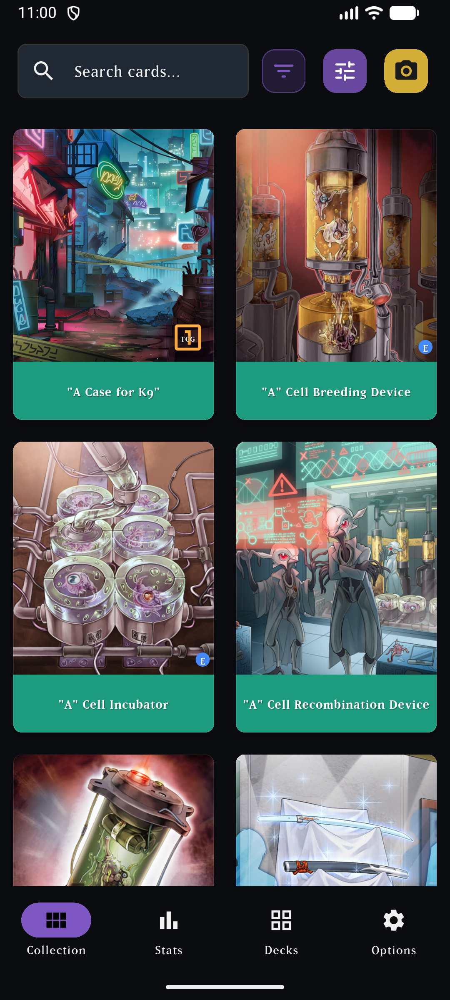
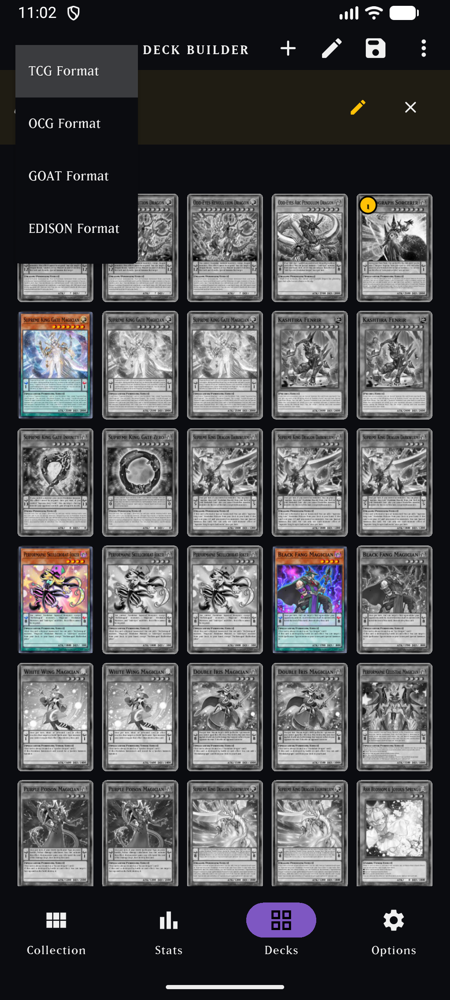
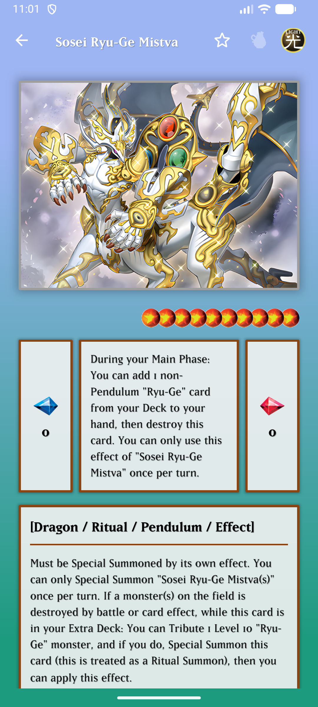
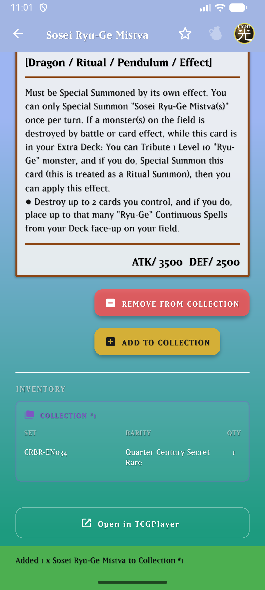
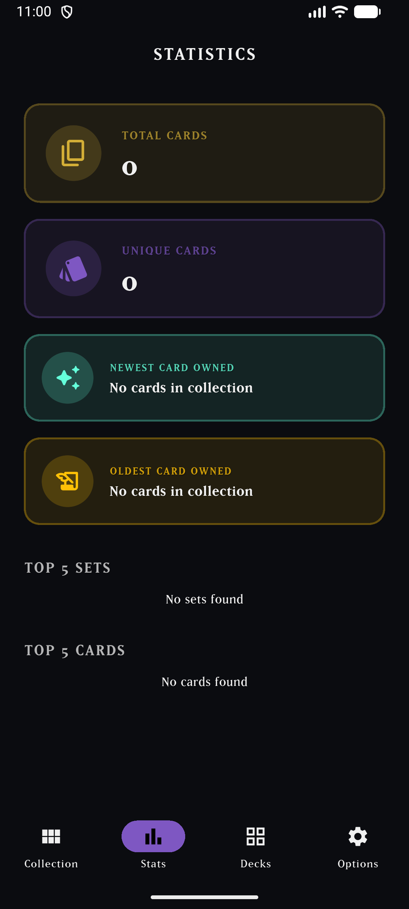
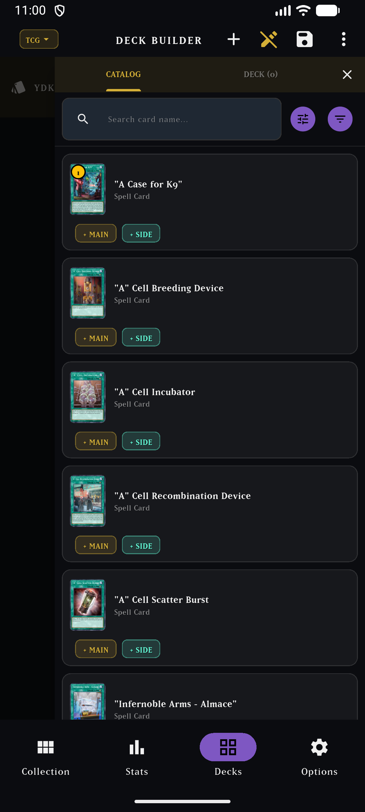
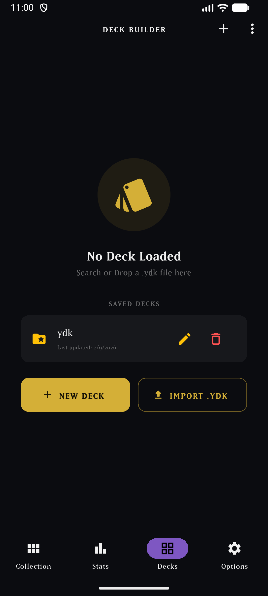
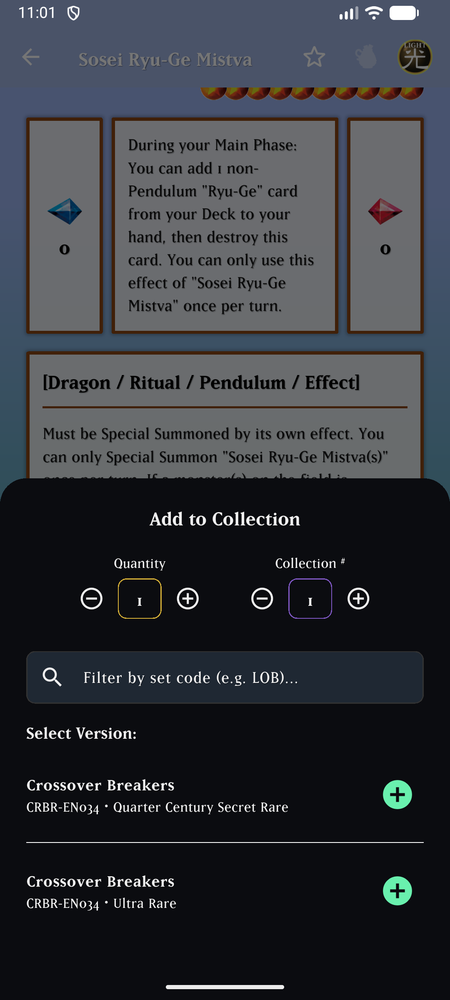
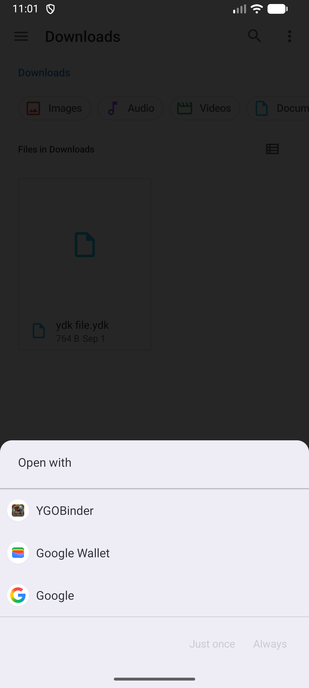
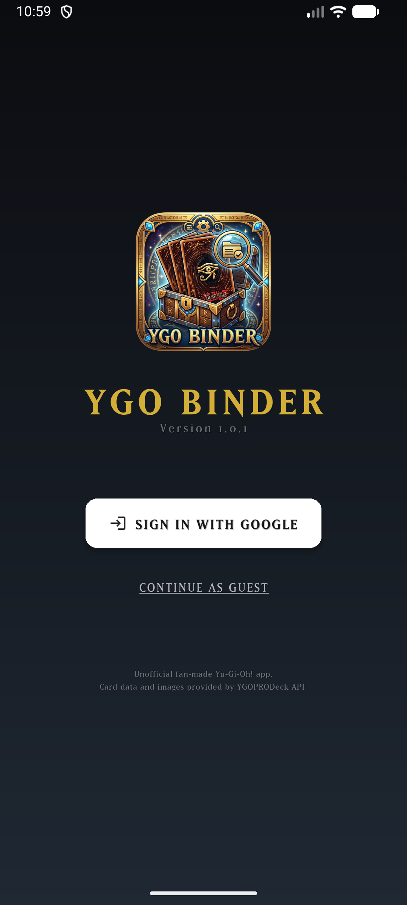

# 🃏 YGOBINDER - Yu-Gi-Oh! Binder & Deck Builder

**YGOBinder** is a modern, responsive, offline-first Yu-Gi-Oh! card collection manager, binder, and deck builder application built with **Flutter**, **Riverpod**, **Drift (SQLite)**, and **Firebase Cloud Sync**.

---

## 📌 App Information

- **Current Version**: `1.3.0+16` (Version 1.3.0)
- **Developer**: Tsuna2001
- **Framework**: Flutter 3.x (Dart 3.x)
- **State Management**: Flutter Riverpod
- **Local Database**: Drift (SQLite)
- **Cloud Backend**: Firebase Authentication & Firestore Sync
- **Card Data Source**: YGOPRODeck, TCGTracking & Open ER APIs

---

## 📱 System Requirements

### 🤖 Android
- **Minimum OS Version**: Android 5.0 (Lollipop) / API Level 21+
- **Recommended OS Version**: Android 12+ / API Level 31+
- **Target SDK**: Android 14 (API Level 34)

### 🍎 iOS
- **Minimum OS Version**: iOS 13.0+
- **Recommended OS Version**: iOS 16.0+

### 💻 Desktop & Web (Local Mode)
- **Windows**: Windows 10+ (64-bit)
- **Linux**: Ubuntu 20.04+ / Debian 11+
- **macOS**: macOS 11.0 Big Sur+
- **Web**: Modern Web Browsers (Chrome, Firefox, Safari, Edge)

---

## ✨ Key Features

- 📚 **Collection & Binder Management**: Track your cards, quantities, conditions, rarities, set codes, purchase prices, and custom collection numbers.
- 🎨 **App Theme Management (Light, Dark, System Default)**:
  - Seamlessly switch between Light Mode, Dark Mode, and System Default theme in Settings with real-time reactivity and local SQLite persistence.
- 📋 **Quote Mode & Quoted Cards Deck (#0)**:
  - Toggle **Quote Mode** when adding cards to store temporary estimation items in **Collection #0** (strictly local, excluded from Cloud sync).
  - Built-in, mandatory **`Quoted Cards (#0)`** deck in the Deck Builder with read-only protection, real-time collection #0 categorization, and auto-close on navigation.
  - Dedicated **Quote Collection Value (#0)** statistic card in Statistics.
  - One-tap **Clear Quote Collection (#0)** option in Settings with confirmation dialog.
- 💱 **Multi-Currency Conversion & Custom Multiplier**:
  - Convert prices across **USD, EUR, GBP, MXN, CAD, JPY, BRL, ARS, CLP, PEN, COP**, or enter a **Custom Rate Multiplier** (e.g. `20.5x`).
  - Automated daily exchange rate synchronization via `open.er-api.com` stored in SQLite.
- 💰 **Deck Total Value & Owned vs Missing Breakdown**:
  - Live **`DECK TOTAL VALUE`** summary container at the end of the Deck Builder displaying **Cards Owned Value** vs **Missing Cards Cost** in active currency.
- 🎴 **Interactive Deck Builder**:
  - Edit decks with live Main, Extra, and Side Deck grids and card counts.
  - Search catalog, add (`+ MAIN`, `+ EXTRA`, `+ SIDE`), and remove (`- REMOVE`) cards seamlessly in both landscape and portrait modes.
  - Create decks from scratch (`+ NEW DECK`) or import `.ydk` files.
  - Automatic replace-on-save for decks with duplicate names.
- 🚫 **Banlist Formats & Legality Badges**: Select between **TCG, OCG, GOAT, and EDISON** formats in the Deck Builder with live legality badges (🔴 `0` Forbidden, 🟡 `1` Limited, 🟠 `2` Semi-Limited).
- 💎 **Live TCGTracking Set Pricing**: Fetch real-time market and low prices for every expansion printing (`See prices` and batch `Update owned card prices`).
- 📈 **Price Trend Indicators**: Live price variation badges showing whether market prices increased (`▲ +$2.50 (+20.8%)`) or decreased (`▼ -$1.20 (-8.3%)`) since last update.
- ⭐ **Favorites & 📜 Wanted Cards**: Mark cards as favorites or wanted with instant local SQLite updates and Cloud Firestore sync.
- 🛍️ **TCGPlayer Direct Search**: Open any card directly in TCGPlayer search with a single tap (`Open in TCGPlayer`).
- 📊 **Collection Statistics**: Overview of total collection value, quoted value, total cards, unique cards, top sets, newest card owned, and oldest card owned.
- 📷 **Camera OCR Scanner**: Scan card set codes using Google ML Kit.
- ☁️ **Firebase Cloud Sync**: Cross-device sync for inventory, decks, favorites, and wanted cards.
- 📱 **Adaptive Responsive Layout**: Optimized for mobile phones (portrait/landscape), tablets, and desktop.

---

## 📱 Application Screenshots & Showcase

  
  
  

### 📸 Features Showcase Gallery

| Collection View | Card Detail & TCGPlayer | Statistics & Insights |
| :---: | :---: | :---: |
|  |  |  |
| *Search, filter & browse card catalog* | *Detailed stats, inventory & TCGPlayer link* | *Total cards, top sets, newest/oldest cards* |

| Deck Builder & Banlists | Deck Editing Mode | Empty Deck Options |
| :---: | :---: | :---: |
|  |  |  |
| *TCG, OCG, GOAT & EDISON banlist badges* | *Add/remove cards in Main, Extra & Side decks* | *Create new deck or import .ydk files* |

| Add to Collection | Open External Files | Login & Cloud Sync |
| :---: | :---: | :---: |
|  |  |  |
| *Manage card printings, sets & rarities* | *Direct .YDK file association* | *Google Sign-in & Guest Mode* |

---

## ☕ Support the Project

If you enjoy using **YGOBinder** and would like to support its continued development, consider supporting me on Ko-fi!

👉 **[Support Tsuna2001 on Ko-fi](https://ko-fi.com/tsunas200121679)**

---

## ⚖️ Legal Disclaimer & Attribution

> [!IMPORTANT]
> **YGOBinder** is an **unofficial fan-made application** and is not affiliated with, endorsed by, or sponsored by **Konami Digital Entertainment**, **Studio Dice**, **SHUEISHA**, or **TV TOKYO**.

- **Yu-Gi-Oh! Trademarks & Copyrights**: All Yu-Gi-Oh! card text, imagery, artwork, graphics, and trademarks belong to **Studio Dice**, **SHUEISHA**, **TV TOKYO**, and **KONAMI**.
- **Card Data, Image & Pricing Attribution**: All card information, market prices, set lists, and card image assets are provided by the [YGOPRODeck API](https://ygoprodeck.com) and [TCGTracking API](https://openapi.tcgtracking.com).
